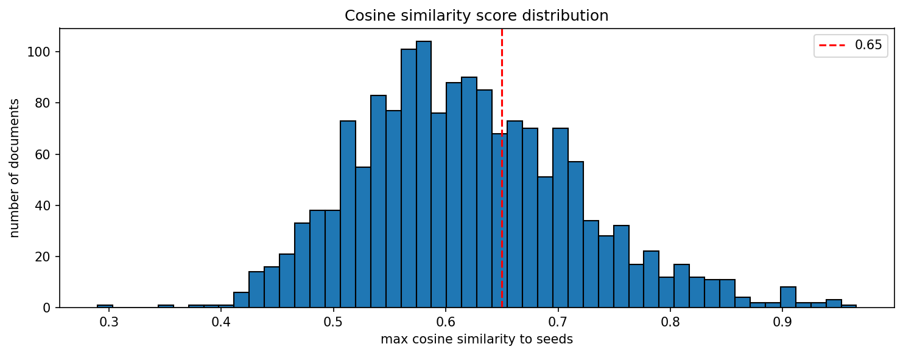

# filter run log

| | |
|---|---|
| date | 2026-05-12 |
| input file | `s:\stbuchho\crises_and_welfare_states\policy-tracker\data\raw\germany\bgbl1_2019-2022_20260408.json` |
| output dir | `s:\stbuchho\crises_and_welfare_states\policy-tracker\data\processed\germany` |
| output prefix | `germany_cov` |

## configuration

| parameter | value |
|---|---|
| AUTO_THRESHOLD | 0.836 |
| BORDERLINE_LOW | 0.73 |

## score distribution

| metric | value |
|---|---|
| min | 0.290 |
| max | 0.966 |
| mean | 0.619 |
| median | 0.611 |

## filtering results

| category | n |
|---|---|
| auto-accepted (>= 0.836) | 45 |
| borderline (0.73–0.835) | 154 |
| below threshold (< 0.73) | 1413 |
| total | 1612 |

## output files

- `s:\stbuchho\crises_and_welfare_states\policy-tracker\data\processed\germany\germany_cov_auto_accepted.json`
- `s:\stbuchho\crises_and_welfare_states\policy-tracker\data\processed\germany\germany_cov_borderline_candidates.json`
