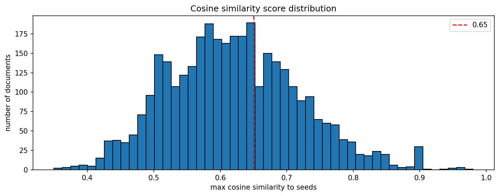

# filter run log

| | |
|---|---|
| date | 2026-05-12 |
| input file | `s:\stbuchho\crises_and_welfare_states\policy-tracker\data\raw\germany\bgbl1_2008-2015_20260409.json` |
| output dir | `s:\stbuchho\crises_and_welfare_states\policy-tracker\data\processed\germany` |
| output prefix | `germany_greatrec` |

## configuration

| parameter | value |
|---|---|
| AUTO_THRESHOLD | 0.799 |
| BORDERLINE_LOW | 0.65 |

## score distribution

| metric | value |
|---|---|
| min | 0.350 |
| max | 0.980 |
| mean | 0.621 |
| median | 0.617 |

## filtering results

| category | n |
|---|---|
| auto-accepted (>= 0.799) | 145 |
| borderline (0.65–0.798) | 1100 |
| below threshold (< 0.65) | 2191 |
| total | 3436 |

## output files

- `s:\stbuchho\crises_and_welfare_states\policy-tracker\data\processed\germany\germany_greatrec_auto_accepted.json`
- `s:\stbuchho\crises_and_welfare_states\policy-tracker\data\processed\germany\germany_greatrec_borderline_candidates.json`
